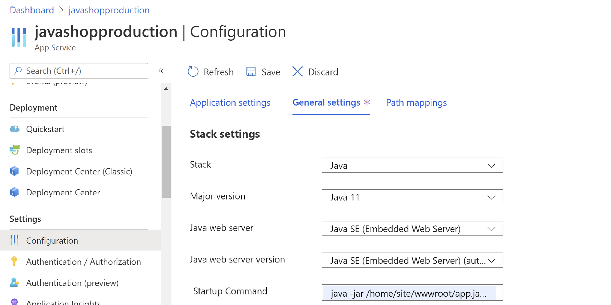

[Return to Agenda](README.md)
<br/>

## Workshop: DevOps for Java shops

### Exercise 3 - Setting up feature flags and configuring App Servers

[Related Microsoft Docs](https://docs.microsoft.com/en-us/azure/azure-app-configuration/quickstart-feature-flag-aspnet-core?tabs=core3x)
 - Create an App Configuration Store
 - Add a feature Manager
 - Set the percentage filter
 - Set up Connection Strings in your Azure Web Apps
 - Set up Java start commands in General settings in Web Apps

### Add a feature Manager

1. To create a new App Configuration store, sign in to the [Azure portal](https://portal.azure.com). In the upper-left corner of the home page, select **Create a resource**. In the **Search the Marketplace** box, enter *App Configuration* and select <kbd>Enter</kbd>.

    

1. Select **App Configuration** from the search results, and then select **Create**.

    

1. On the **Create App Configuration** pane, enter the following settings:

    | Setting | Suggested value | Description |
    |---|---|---|
    | **Subscription** | Your subscription | Select the Azure subscription that you used for the rest of the workshop. |
    | **Resource group** | *Workshop resource Group* | Use the same workshop resource group for your App Configuration store resource. |
    | **Resource name** | Globally unique name | Enter a unique resource name to use for the App Configuration store resource. The name must be a string between 5 and 50 characters and contain only numbers, letters, and the `-` character. The name can't start or end with the `-` character. |
    | **Location** | *Workshop location* | Use the same  workshop location as the other components of your application. |
    | **Pricing tier** | *Free* | Select the desired pricing tier. For more information, see the [App Configuration pricing page](https://azure.microsoft.com/pricing/details/app-configuration). |

1. Select **Review + create** to validate your settings.

1. Select **Create**. The deployment might take a few minutes.

1. After the deployment finishes, navigate to the App Configuration resource. Select **Settings** > **Access keys**. Find the primary read-only key connection string. You'll use this connection string later to configure your application to communicate with the App Configuration store that you created.

1. Select **Operations** > **Feature manager** > **Add** to add a feature flag called *Beta*.

     > 

    Leave **Label** empty for now. Select **Apply** to save the new feature flag.

1. Click on the ellipsis on the right, and select **Advanced Edit**.  Paste this in to the dialog and Select **Apply** to save the new feature flag:

```dotnetcli 
{
	"id": "Beta",
	"description": "",
	"enabled": true,
	"conditions": {
		"client_filters": [
			{
				"name": "Microsoft.Percentage",
				"parameters": {
					"Value": 50
				}
			}
		]
	}
}
```

This sets up a feature flag with the percentage filter, meaning 50% of users will see a new feature and 50% of users will not.  


### Retrieve the Access Key for the Azure App Configuration

In App Configuration, navigate to Settings > Access Keys> Read-Only Key > Primary Key, and copy the connection String.  

**Save this connection string locally, as you will be reusing it serveral times during this workshop**

### Set up Application Settings and Java startup commands in your Azure Web Apps

In the Azure portal, search for and select App Services, and then select your staging app. In the app's left menu, select Configuration > Application settings.

Select your Web app. In the app's left menu, select **Configuration** > **Application settings**.


> Application Settings and Connection strings are always encrypted when stored (encrypted-at-rest).

To add a new Application Setting, click **New Application Setting**. 

The name should be **APP_CONFIGURATION_CONNECTION_STRING** and the value should be the connection string from your App Configuration, starting with **Endpoint=**

#### 
In the app's left menu, select **Configuration** > **General settings**.

In **Startup Command**, add: 

**java -jar /home/site/wwwroot/demo-0.0.1-SNAPSHOT.jar --server.port=80**

When finished, click **Update**. Don't forget to click **Save** back in the **Configuration** page.
 
The application should restart at this time.  Open the Web Site Address from the overview, and you should see the Web site.  Refresh the app a few times and see if you notice any differences in the menu.

Repeat these steps to add the Application settings to your Production App.


FOr the GitHub App, use the same application setting, but use this startup command:

**java -jar /home/site/wwwroot/app.jar --server.port=80**



