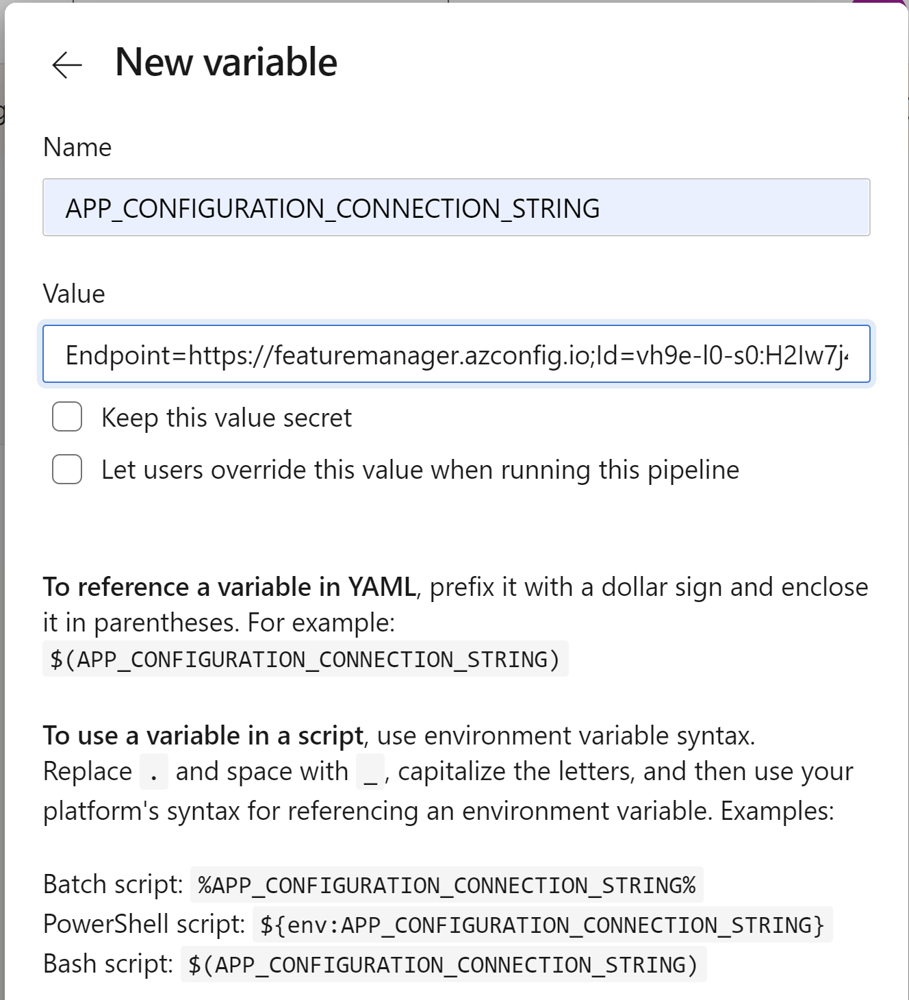

[Return to Agenda](README.md)
 

## Workshop: DevOps for Java shops

### Exercise – 4 - Azure DevOps for CI

[Related Microsoft Learn Materials](https://docs.microsoft.com/en-us/learn/modules/create-a-build-pipeline/)

 - Connect a repo to an Azure DevOps project using the Azure Pipelines extension in the GitHub marketplace
 - Choose the default build template
 - Replace the default template with a provided template
 - Add and run the customized build template
 - Review hosted agents
 - Review the build log

[Azure Pipelines](https://azure.microsoft.com/services/devops/pipelines/) enable you to continuously build, test, and deploy to any platform or cloud. It has cloud-hosted agents for Linux, macOS, and Windows; powerful workflows with native container support; and flexible deployments to Kubernetes, VMs, and serverless environments.

   

### Setting up Azure Pipelines

1. On GitHub, navigate to your fork of the **devopsforjavashops-TestABAzureDevOPs** repository.
1. If you’re not already signed in to GitHub, sign in now.

### Exercise 1: Setting up automated CI/CD pipelines with Azure Pipelines

The first thing we need to do is to connect GitHub with Azure DevOps, which we can do via the **Azure Pipelines** extension in the GitHub Marketplace.

### Task 1: Installing Azure Pipelines from GitHub Marketplace

**Azure Pipelines** is available in GitHub Marketplace which makes it even easier for teams to configure a CI/CD pipeline for any application using your preferred language and framework as part of your GitHub workflow in just a few simple steps

1. Switch to the browser tab open to the root of your GitHub fork.

1. Navigate to the **GitHub Marketplace**.

    

1. Search for "**pipelines**" and click **Azure Pipelines**.
   
    

1. Scroll to the bottom and click **Install it for free**. If you previously installed Azure Pipelines, select **Configure access** instead to skip steps 6-8.
    
    

   > Azure Pipelines is free to use for both public and private repos. You get unlimited build minutes and 10 free parallel jobs for public repositories. For private repos, you get 1 free parallel job and 1800 minutes per month. If you have a need to scale your builds, you can add parallel job support for a nominal fee.

1. If you have multiple **GitHub** accounts, select the one you forked the project to from the **Switch billing account** dropdown.

    

1. Click **Complete order and begin installation**.

     

1. Select the repositories you want to include (or **All repositories**) and click Install.
 
    > If you've previously installed Azure Pipelines, you may need to toggle between the **All** and **Select** radio buttons to enable the wizard in Task 2. You can always create the pipeline directly from Azure Pipelines if the wizard does not appear.

     

## Task 2: Configuring a Continuous Integration Pipeline

Now that Azure Pipelines has been installed and configured, we can start building the pipelines but we will need to select a project where the pipeline will be saved. You may select an existing or create a new Azure DevOps project to hold and run the pipelines we need for continuous integration and continuous delivery. The first thing we'll do is to create a CI pipeline.

1. Select the organization and Azure DevOps project that you want to use. If you do not have one, you can create both for free.

   

1. Select the forked repo.

   

   Every build pipeline is simply a set of tasks. Whether it's copying files, compiling the source, or publishing artifacts, the existing library of tasks covers the vast majority of scenarios. You can even create your own if you have specialized needs not already covered. We're going to use YAML, a markup syntax that lends itself well to describing the build pipeline. Note that the Node.js pipeline as a starting point based on an analysis of our source project. We'll replace the contents with the final YAML required for our project.

1. Select **Maven** as the recommended template if prompted.

1. Replace the default template YAML with the contents of the  **provided-azure-pipeline.yml** file in your fork of the **devopsforjavashops-TestABAzureDevOPs** repository.

#### Add a variable 

Click **Variables** on the right, then **New Variable**.

The name should be **APP_CONFIGURATION_CONNECTION_STRING** and the value should be the connection string from your App Configuration, starting with **Endpoint=**

   

1. Click **Save and run**.

1. Confirm the **Save and run** to commit the YAML definition directly to the master branch of the repo.

1. Follow the build through to completion.
1. Review the build logs
    