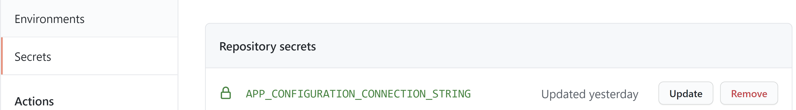

[Return to Agenda](README.md)
 

## Workshop: DevOps for Java shops

### Exercise 7 - Generating a template with deployment manager

[Related Materials on Microsoft Docs](https://cda.ms/1XJ)

[Related Microsoft Learn Materials](https://cda.ms/1XK)
 
  - Deploy to an Azure Web App using the Web App Deployment Center using GitHub Actions

 - Review the workflow results

 - Set up an App Config connection string in GitHub Secrets

 - Rerun the deployment

 - Review the results

 ## Deploy to an Azure Web App using the Web App Deployment Center
 
You can quickly get started with GitHub Actions by using the App Service Deployment Center. This will automatically generate a workflow file based on your application stack and commit it to your GitHub repository in the correct directory.

1. Navigate to the webapp that you just created in the Azure portal
1. On the left side, click **Deployment Center**
1. Under **Continuous Deployment (CI / CD)**, select **GitHub**
1. Next, select **GitHub Actions**
1. Use the dropdowns to select your GitHub repository, branch, and application stack

1. On the final screen, you can review your selections and preview the workflow file that will be committed to the repository. If the selections are correct, click **Finish**

This will commit the workflow file to the repository. The workflow to build and deploy your app will start immediately.
 
## Review the workflow results
Note that the workflow fails, as we have not yet set up a connection string to the Application Configuration store.  
 
### Add an App Configuration connection string as a repository secret

A GitHub tool called Secret Manager stores sensitive data for development work outside of your project tree. This approach helps prevent the accidental sharing of app secrets within source code. Complete the following steps to enable the use of Secret Manager in the ASP.NET Core project:

Open the repo and navigate to settings > secrets > repository secret

Secrets are always encrypted when stored (encrypted-at-rest).

Click **New secret**. 

The name should be **APP_CONFIGURATION_CONNECTION_STRING** and the value should be the connection string from your App Configuration, starting with **Endpoint=**

When finished, click **Update**. 

Then edit the generated workflow in the repo, edit this workflow file and add this under name:

env: 
      APP_CONFIGURATION_CONNECTION_STRING: ${{ secrets.APP_CONFIGURATION_CONNECTION_STRING }}
 

Commit The code.
The Action workflow should should restart at this time, and deploy correctly.  

Open the Web Site Address from the overview, and you should see the Web site.  

